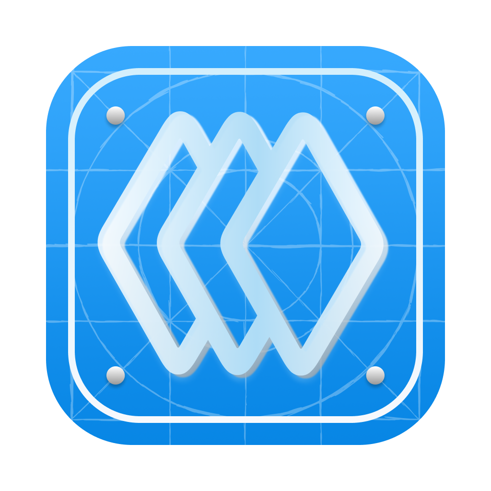
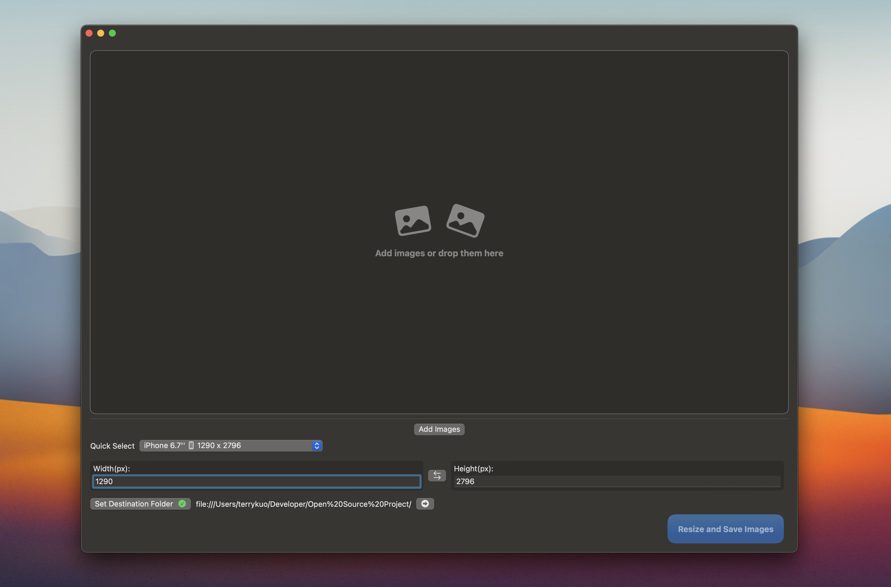
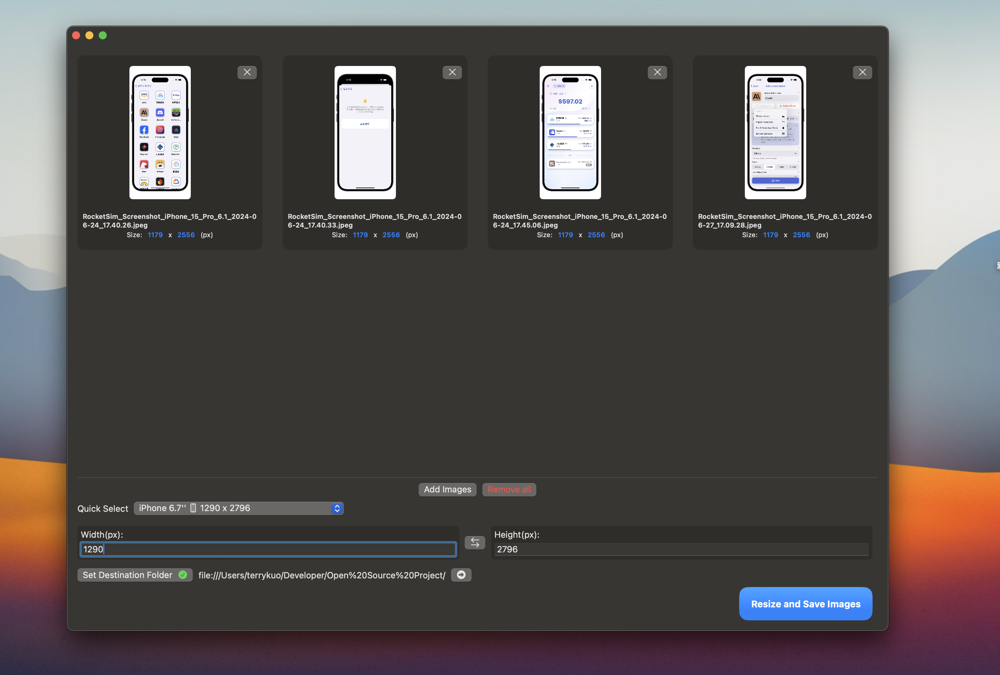
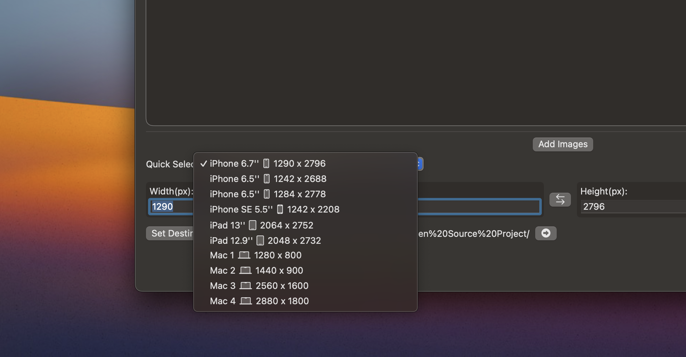

# PicPulse: Batch Images Resizer 

<!---

-->

*PreShots has been renamed to PicPulse* 

A native batch images resizer for macOS

Free & Open Source

# Download & Install

[Download on the App Store](https://apps.apple.com/tw/app/picpulse-batch-images-resizer/id6503602987?mt=12) or manually download it in the [release](https://github.com/universeye/PreShots/releases) page.

> No need to worry about the reliability of non-App Store installations, PicPulse is signed and [notarized](https://developer.apple.com/documentation/security/notarizing_macos_software_before_distribution).

# Screenshots

  

## Note

* iPad support is still in development
* Please add your own RevenueCat API key

## Welcome to pull requests for these

* support other languages
* fix bugs

If you have other good ideas 💡, feel free to send an E-mail to me.

## Contributions

* All kinds of contributions (enhancements, new features, documentation & code improvements, issues & bugs reporting & todo task) are welcome. Let's make it better.

## Contact
Developed by [Terry Kuo](https://bento.me/terrykuo)

Feel free to contact me!

## License

MIT
